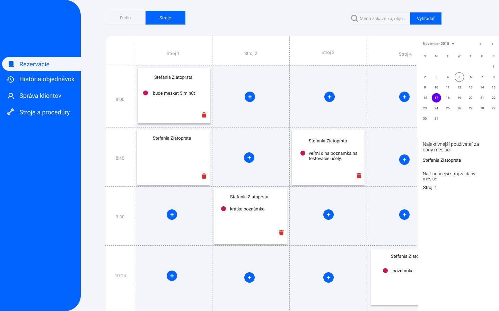

[TOC]

# Katalóg požiadaviek

## 1 Úvod

### 1.1 Účel dokumentu
Tento dokument slúži na opísanie požiadaviek ku projektu Rezervačný systém pre fitness centrum. Obsahuje požiadavky zadávateľa, školiteľa a je záväzný pre zadávateľa a realizátorov projektu.

### 1.2 Rozsah využitia systému
Účelom aplikácie je riešiť rezerváciu klientov fitness centra, pričom aplikácia má ponúkať možnosť ukladania rozličných informácii o klientoch, strojoch a procedúrach vo fitness centre. Aplikáciu bude určená len pre zamestnancov fitness centra, aby za jej pomoci mohli ponúkať služby fitness centra efektívnejšie.

### 1.3 Slovník pojmov
- okno času = 45 minút
- aktivita = stroj alebo procedúra na ktorú sa da objednať

### 1.4 Odkazy a referencie

#### Dokumentácia k React
https://reactjs.org/docs/getting-started.html

#### Dokumentácia k Laravel
https://laravel.com/docs/6.x

### 1.5 Prehľad nasledujúcich kapitol
V ďalších kapitolách sa čitateľ môže dozvedieť o tom, pre koho je aplikácia určená, konkrétnych atomických požiadavkách, ktoré bude spĺňať finálna verzia aplikácie.

## 2 Všeobecný popis

### 2.1 Perspektíva systému
Aplikácia bude slúžiť hlavne na objednávku klientov fitness centra na rôzne stroje a procedúry. Okrem tejto funkcionality bude ukladať informácie o klientoch a o procedúrach. Používateľ aplikácie bude mať možnosť tieto informácie aj meniť. Zároveň bude aplikácia ponúkať veľmi základné štatistiky o návštevnosti. Aplikácia bude slúžiť len pre jedného užívateľa, čiže administrátora, ale zdrojový kód bude písaný takým spôsobom, aby bolo možné dotvoriť samoobslužné objednávanie pre klientov, ak niekedy v budúcnosti vznikne takáto potreba. 

### 2.2 Funkcie systému
Aplikácia sa bude pripájať k databáze, z ktorej bude získavať informácie o klientoch, strojoch, objednávkach a bude túto databázu aktualizovať. Pri aktualizáciách bude upravovať informácie o klientoch, ktorých bude môcť pridávať a odstraňovať a rovnako bude môcť pracovať aj s informáciami o strojoch a objednávkach. Prístup k jednotlivým funkciám je znázornený na nasledovnom obrázku.

### 2.3 Charakteristika používateľa
V aplikácii bude len jeden typ používateľa. Tento používateľ teda bude môcť využívať všetky funkcie aplikácie.
Aplikácie je určená pre zamestnanca fitness centra, ktorý eviduje objednávky zákazníkov a vyťaženosť fitness centra.

### 2.4 Všeobecné obmedzenia
Aplikáciu bude možné spúšťať len cez webový prehliadač. Podmienky pre minimálne verzie prehliadačov sú nasledovné:
- Google Chrome 49+
- Mozilla Firefox 46+
- Microsoft Edge 13+
- Apple Safari 8+
- Opera 27+

### 2.5 Predpoklady a závislosti
Systém bude závislý na databáze, z ktorej bude získavať údaje o klientoch, strojoch, procedúrach a objednávkach.

## 3 Špecifické požiadavky

### 3.1 Funkčné požiadavky

#### R01 Možnosť vyhľadávať v klientoch
Aplikácia umožňuje rýchle vyhľadávanie klientov v databáze podľa mena, priezviska alebo telefónneho čísla. Klienta je možné vyhľadať pomocou ktoréhokoľvek údaju a je možné vyhľadávať aj pomocou viacerých údajov naraz.

#### R02 Pridávanie klientov
Aplikácia umožňuje pridávanie klientov, ktorí sa budú môcť následne dať nastaviť ako objednávatelia aktivít a vyhľadávať v systéme.

#### R03 Odstraňovanie klientov
Aplikácia umožňuje odstránenie klienta z databázy.

#### R04 Príznak o aktívnosti klienta

Aplikácia umožňuje nastaviť klientovi príznak, či je aktívny alebo neaktívny.

#### R05 Príznak o podpísaní GDPR

Aplikácia umožňuje nastaviť klientovi príznak, či podpísal alebo nepodpísal GDPR.

#### R06 Príznak o rekreačnej karte

Aplikácia umožňuje nastaviť klientovi príznak, či využíva rekreačnú kartu.

#### R07 Editovanie klientov
Aplikácia umožňuje zmenu údajov o klientoch.

#### R08 Možnosť rezervácie aktivít pre klienta v danom čase

Aplikácia umožňuje vytvoriť rezerváciu pre daného klienta na daný čas a na danú aktivitu.

#### R09 Pridávanie poznámok do objednávky aktivity
Každá objednávka má klienta, aktivitu a ešte je k nej možné pridať poznámku.

#### R10 Rýchly prístup k dnešnému dňu v kalendári
Aplikácia umožňuje rýchly prístup k dnešnému dňu na kalendári, aj keď sa administrátor nachádza ľubovoľnej časti kalendára.

#### R11 Pridávanie klienta na viacero aktivít
Ak si vyhľadáme klienta na pridanie do aktivít, tak môžeme mu zaradiť viacero časových okien aj viacero aktivít bez nutnosti opätovného vyhľadávania používateľa.

#### R12 Editovanie objednávok aktivít
Aplikácia umožňuje zmeniť klienta, pridať poznámku alebo zmeniť aktivitu na dané okno.

#### R13 Odstraňovanie objednávok aktivít

Aplikácia umožňuje odstránenie objednávky na danú aktivitu.

#### R14 Prezeranie histórie objednávok pre používateľa

Aplikácia umožňuje prezeranie histórie objednávok pre používateľa.

#### R15 Prezeranie histórie objednávok pre aktivitu

Aplikácia umožňuje prezeranie histórie objednávok pre aktivitu.

#### R16 Pridanie stroja/procedúry

Aplikácia umožňuje pridanie ďalšieho stroja/procedúry do databázy.

#### R16 Odstránenie stroja/procedúry

Aplikácia umožňuje odstránenie stroja/procedúry z databázy.

#### R17 Prihlásenie do aplikácie

Aplikácia umožňuje prihlásenie používateľa. Bez prihlásenia nie je možný prístup ku žiadnym informáciám o klientoch.

### 3.2 Požiadavky nevzťahujúce sa na funkcionalitu
Systém bude dodaný ako webová aplikácia, ktorá sa bude spúšťať cez jeden z podporovaných webových prehliadačov, ktoré sú vyššie uvedené. Bude ju možne spustiť na rôznych platformách od mobilných telefónov po stolové počítače, čiže aplikácia bude plne responzívna.

### 3.3 Požiadavky rozhrania

Aplikácia bude interagovať s používateľom cez webový prehliadač.